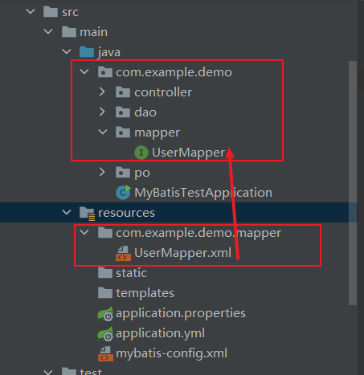

# 1、MyBatis简介

## 1.1、和其它持久化层技术对比

**JDBC**

1. SQL夹在Java代码块里，耦合度高导致硬编码内伤

2. 维护不易且实际开发需求中sql是有变化，频繁修改的情况多见


**Hibernate和JPA**

1. 长难复杂SQL，对于Hibernate而言处理也不容易
2. 内部自动生产的SQL，不容易做特殊优化。
3. 基于全映射的全自动框架，大量字段的POJO进行部分映射时比较困难，导致数据库性能下降。


**MyBatis**

MyBatis是一个半自动化的持久化层框架。

1. 对开发人员而言，核心sql还是需要自己优化
2. sql和java编码分开，功能边界清晰，一个专注业务、一个专注数据。


# 2、搭建MyBatis

## 2.1、创建maven工程

引入依赖:mybatis,junit,mysql-connector-java

## 2.2、创建MyBatis的核心配置文件

习惯上命名为`mybatis-config.xml`，这个文件名仅仅只是建议，并非强制要求。将来整合Spring之后，这个配置文件可以省略，所以大家操作时可以直接复制、粘贴。
核心配置文件主要用于配置连接数据库的环境以及MyBatis的全局配置信息
核心配置文件存放的位置是src/main/resources目录下

```xml-dtd
<?xml version="1.0" encoding="UTF-8" ?> 
<!DOCTYPE configuration  
PUBLIC "-//mybatis.org//DTD Config 3.0//EN"  
"http://mybatis.org/dtd/mybatis-3-config.dtd">  
<configuration>  
	<!--设置连接数据库的环境-->  
	<environments default="development">  
		<environment id="development">  
			<!--设置连接方式:jdbc-->
			<transactionManager type="JDBC"/>  
			<dataSource type="POOLED">  
				<property name="driver" value="com.mysql.cj.jdbc.Driver"/>  
				<property name="url" value="jdbc:mysql://localhost:3306/MyBatis"/>  
				<property name="username" value="root"/>  
				<property name="password" value="123456"/>  
			</dataSource>  
		</environment>  
	</environments>  
	<!--引入映射文件-->  
	<mappers>  
		<mapper resource="mappers/UserMapper.xml"/>  
	</mappers>  
</configuration>
```

## 2.3、创建mapper接口

> MyBatis中的mapper接口相当于以前的dao。但是区别在于，mapper仅仅是接口，我们不需要提供实现类

```java

public interface UserMapper {

    /**
     * MyBatis面向接口变成的两个一致:
     * 1、映射文件的nampespace要和mapper接口的全类型保持一致
     * 2、映射文件中的SQL语句的id要和mapper接口中的方法一致
     */

    /**
     * 添加用户信息
     * 返回值是int表示查询结果的行数
     * @return
     */
    int insertUser();
}
```

## 2.4、创建MyBatis的映射文件（重点++）

**相关概念**：ORM（Object Relationship Mapping）对象关系映射。

- 对象：Java的实体类对象
- 关系：关系型数据库
- 映射：二者之间的对应关系

| Java概念 | 数据库概念 |
| -------- | ---------- |
| 类       | 表         |
| 属性     | 字段/列    |
| 对象     | 记录/行    |

**映射文件的命名规则**

- 表所对应的实体类的类名+Mapper.xml
- 例如：表t_user，映射的实体类为User，所对应的映射文件为UserMapper.xml
- 因此一个映射文件对应一个实体类，对应一张表的操作
- MyBatis映射文件用于编写SQL，访问以及操作表中的数据
- MyBatis映射文件存放的位置是src/main/resources/mappers目录下

**MyBatis中可以面向接口操作数据，要保证两个一致(重点++)**

- mapper接口的全类名和映射文件的命名空间（namespace）保持一致
- mapper接口中方法的方法名和映射文件中编写SQL的标签的id属性保持一致

```xml
<!DOCTYPE mapper
        PUBLIC "-//mybatis.org//DTD Mapper 3.0//EN"
        "http://mybatis.org/dtd/mybatis-3-mapper.dtd">
<mapper namespace="com.example.demo.mapper.UserMapper">
    <!--
        2、映射文件中的SQL语句的id要和mapper接口中的方法一致
        int insertUser();
    -->
    <insert id="insertUser">
        insert into t_user values(null,'admin','123',23,'男','1234@q.com')
    </insert>
</mapper>
```


## 2.5、通过junit测试功能

- **SqlSession**：代表Java程序和数据库之间的会话。（HttpSession是Java程序和浏览器之间的会话）
- **SqlSessionFactory**：是“生产”SqlSession的“工厂”
- **工厂模式**：如果创建某一个对象，使用的过程基本固定，那么我们就可以把创建这个对象的相关代码封装到一个“工厂类”中，以后都使用这个工厂类来“生产”我们需要的对象

```java
public class TestSqlSession {
    public SqlSessionFactory getSqlSessionFactory() throws IOException {
        //读取核心配置文件作为输入流
        InputStream is = Resources.getResourceAsStream("mybatis-config.xml");
        //获取sqlSessionFactory
        SqlSessionFactory sqlSessionFactory = new SqlSessionFactoryBuilder().build(is);
        return sqlSessionFactory;
    }

    @Test
    public void testSqlSession() throws IOException {
        //1.获取SqlSessionFactory
        SqlSessionFactory sqlSessionFactory = getSqlSessionFactory();

        /**
         * 2.获取SqlSession,
         * openSession默认值为false；需要手动提交事务
         * openSession默认值为true时自动提交事务
         */
        SqlSession sqlSession = sqlSessionFactory.openSession(true);

        //3.获取mapper接口对象,底层会自动实现接口
        UserMapper mapper = sqlSession.getMapper(UserMapper.class);

        //4.测试功能
        int res = mapper.insertUser();
        //JDBC连接方式,需要手动提交事务
        //sqlSession.commit();
        System.out.println("res:" + res);
    }
}

```

- 此时需要手动提交事务，如果要自动提交事务，则在获取sqlSession对象时，使用`SqlSession sqlSession = sqlSessionFactory.openSession(true);`，传入一个Boolean类型的参数，值为true，这样就可以自动提交

  

## 2.6、加入log4j日志功能

**log4j.properties**

```properties
log4j.rootLogger=DEBUG,A1

log4j.appender.A1=org.apache.log4j.ConsoleAppender
log4j.appender.A1.layout=org.apache.log4j.PatternLayout
log4j.appender.A1.layout.ConversionPattern=[%t] [%c]-[%p] %m%n
```

**日志的级别**：FATAL(致命)>ERROR(错误)>WARN(警告)>INFO(信息)>DEBUG(调试) 从左到右打印的内容越来越详细

```log
12:39:35.235 [main] DEBUG com.example.demo.mapper.UserMapper.insertUser - ==>  Preparing: insert into t_user values(null,'admin','123',23,'男','1234@q.com')
12:39:35.258 [main] DEBUG com.example.demo.mapper.UserMapper.insertUser - ==> Parameters: 
12:39:35.261 [main] DEBUG com.example.demo.mapper.UserMapper.insertUser - <==    Updates: 1  #返回一个结果
12:39:35.261 [main] DEBUG org.apache.ibatis.transaction.jdbc.JdbcTransaction - Committing JDBC Connection [com.mysql.cj.jdbc.ConnectionImpl@f0da945]
```


# 3、MyBatis的增删改查

## 3.1、增加

```xml
<mapper namespace="com.example.demo.mapper.UserMapper">
    <!--
        2、映射文件中的SQL语句的id要和mapper接口中的方法一致
        int insertUser();
    -->
    <insert id="insertUser">
        insert into t_user values(null,'admin','123',23,'男','1234@q.com')
    </insert>
</mapper>
```

```java
int res = mapper.insertUser();
```


## 3.2、修改

```xml
<mapper namespace="com.example.demo.mapper.UserMapper">
    <!--    void updateUser();-->
    <update id="updateUser">
        update t_user set username = '张三' where id = 1
    </update>
</mapper>
```

```java
mapper.updateUser();
```


## 3.3、删除

```xml
<mapper namespace="com.example.demo.mapper.UserMapper">
    <!--  void deleteUser();  -->
    <delete id="deleteUser">
        delete from t_user where id = 3
    </delete>
</mapper>
```

```java
mapper.deleteUser();
```


## 3.4、查

```xml
<mapper namespace="com.example.demo.mapper.UserMapper">
    <!--    User getUserById();-->
    <!--
        查询功能的标签必须设置resultType或resultMap用于告知MyBatis结果的类型
        resultType: 设置默认的映射关系(属性名称和数据库字段要一一对应)
        resultMap: 设置自定义的映射关系
    -->
    <select id="getUserById" resultType="com.example.demo.po.User">
        select * from t_user where id = 1
    </select>

    <!--    List<User> getAllUser();-->
    <select id="getAllUser" resultType="com.example.demo.po.User">
        select * from t_user
    </select>
</mapper>
```

```java
//4.测试功能CRUD
        //查询单个
        User userById = mapper.getUserById();
        System.out.println(userById);
        //User(id=1, username=张三, password=123, age=23, sex=男, email=1234@q.com)

        //查询所有
        List<User> user_list = mapper.getAllUser();
        user_list.forEach(user -> System.out.println(user));
        /**
         * User(id=1, username=张三, password=123, age=23, sex=男, email=1234@q.com)
         * User(id=2, username=admin, password=123, age=23, sex=男, email=1234@q.com)
         */
```


注意：

1. 查询的标签select必须设置属性resultType或resultMap，用于设置实体类和数据库表的映射关系
   - resultType：自动映射，用于属性名和表中字段名一致的情况
   - resultMap：自定义映射，用于一对多或多对一或字段名和属性名不一致的情况

# 4、核心配置文件详解

```xml
<?xml version="1.0" encoding="UTF-8" ?>
<!DOCTYPE configuration
        PUBLIC "-//mybatis.org//DTD Config 3.0//EN"
        "http://mybatis.org/dtd/mybatis-3-config.dtd">
<configuration>

    <!--
    核心配置文件中的标签必须按照固定的顺序(有的标签可以不写，但顺序一定不能乱):
    properties?,settings?,typeAliases?,typeHandlers?
    ,objectFactory?,objectWrapperFactory?,reflectorFactory?,
    plugins?,environments?,databaseIdProvider?,mappers?
    -->
    <!-- 引入properties文件,从配置中取出数据库地址,账号,密码  -->
    <properties resource="application.properties"/>

    <!--设置类型别名-->
    <typeAliases>
        <!--
            设置这个属性以后,在UserMapper.xml就可以用alias代替type
            alias的默认值为类型的别名,不区分大小写
         -->
        <!--        <typeAlias type="com.example.demo.po.User" alias="User"></typeAlias>-->

        <!--以包为单位,将包下所有的类型设置默认的类型别名:主要用于给包下多个类设置别名-->
        <package name="com.example.demo.po"/>
    </typeAliases>

    <!--
        environments: 设置连接数据库的环境
        属性:
            default: 设置默认使用的环境的id
     -->
    <environments default="development">
        <!--
        environment: 设置某个具体的环境
        属性:
            id: 表示连接数据库的环境的唯一标识,不能重复
        -->
        <environment id="development">
            <!--
                transactionManager: 设置事务管理方法
                属性:
                    type="JDBC|MANAGED"
                    JDBC: 标识当前环境中,执行SQL时,使用的是JDBC中的原生事务管理方式,事务的提交或回滚需要手动执行
                    MANAGED: 被管理,例如Spring
            -->
            <transactionManager type="JDBC"/>
            <!--
                dataSource:配置数据源    Spring中有数据源,不需要关心
                属性:
                    type:设置数据源的类型
                    type="POOLED|UNPOOLED|JNDI"
                    POOLED:标识使用数据库连接池缓存数据库连接
                    UNPOOLED:标识不使用数据库连接池
                    JNDI:标识使用上下文中的数据库
            -->
            <dataSource type="POOLED">
                <!--设置连接数据库的驱动-->
                <property name="driver" value="${jdbc.driver}"/>
                <!--设置连接数据库的连接地址-->
                <property name="url" value="${jdbc.url}"/>
                <!--设置连接数据库的用户名-->
                <property name="username" value="${jdbc.username}"/>
                <!--设置连接数据库的密码-->
                <property name="password" value="${jdbc.password}"/>
            </dataSource>
        </environment>
    </environments>
    <!--引入映射文件-->
    <mappers>
        <!--        <mapper resource="mappers/UserMapper.xml"/>-->
        <!--
            以包为单位引入映射文件(批量引入)
            要求:
            1.mapper接口所在的包要和映射文件所在的包一致:
                java.com.example.demo.mapper == resources.com.example.demo.mapper
            2.mapper接口要和映射文件的名字一致:
                UserMapper.java == UserMapper.xml
        -->
        <package name="com.example.demo.mapper"/>
    </mappers>
</configuration>
```

常用的配置标签:

- 属性（properties）:从配置中取出数据库地址,账号,密码

- 类别名（typeAliases）:给类设置名别,默认是类名

- 映射文件（mappers）:方法和sql语句的映射关系



# 5、MyBatis获取参数值的两种方式（重点）

- MyBatis获取参数值的两种方式：**${}**和**#{}**
- ${}的本质就是字符串拼接，#{}的本质就是占位符赋值
- ${}使用字符串拼接的方式拼接sql，若为字符串类型或日期类型的字段进行赋值时，需要手动加单引号；但是#{}使用占位符赋值的方式拼接sql，此时为字符串类型或日期类型的字段进行赋值时，可以自动添加单引号
  

## 5.1、单个字面量类型的参数

- 若mapper接口中的方法参数为单个的字面量类型，此时可以使用${}和#{}以任意的名称（最好见名识意）获取参数的值，注意${}需要手动加单引号

```java
    // 情况1:mapper接口方法的参数为单个的字面变量类型
    @Test
    public void testParam() {
        //1.获取SqlSession
        SqlSession sqlSession = getSqlSession();

        //3.获取mapper接口对象,底层会自动实现接口
        ParamMapper mapper = sqlSession.getMapper(ParamMapper.class);

        List<User> user_list = mapper.getUserByName(username);
        user_list.forEach(user -> System.out.println(user));
    }
```

```xml
<!--  public User getUserByName(String username);  -->
    <select id="getUserByName" resultType="User">
        <!--  占位符方式      -->
        select * from t_user where username = #{username}
        <!--   字符替换方法需要手动添加单引号     -->
        <!--        select * from t_user where username = '${username}'-->
    </select>
```

## 5.2、多个字面量类型的参数

- 若mapper接口中的方法参数为多个时，此时MyBatis会自动将这些参数放在一个map集合中
  	以arg0,arg1…为键，以参数为值；
  	以param1,param2…为键，以参数为值；
- 因此只需要通过${}和#{}访问map集合的键就可以获取相对应的值，注意${}需要手动加单引号。
- 使用arg或者param都行，要注意的是，arg是从arg0开始的，param是从param1开始的

```java
    // 2、mapper接口方法的参数为多个时
    @Test
    public void checkLogin() {
        //1.获取SqlSession
        SqlSession sqlSession = getSqlSession();

        //3.获取mapper接口对象,底层会自动实现接口
        ParamMapper mapper = sqlSession.getMapper(ParamMapper.class);

        User user = mapper.checkLogin(username, password);
        System.out.println(user);
    }
```

```xml
    <!--    User checkLogin(String username,String password);-->
    <select id="checkLogin" resultType="User">
        <!--  占位符方式      -->
        select * from t_user where username = #{param1} and password = #{param2}
        <!--   字符替换方式     -->
        <!--        select * from t_user where username = '${param1}' and password = '${param2}'-->
    </select>
```

## 5.3、map集合类型的参数

- 若mapper接口中的方法需要的参数为多个时，此时可以手动创建map集合，将这些数据放在map中只需要通过${}和#{}访问map集合的键就可以获取相对应的值，注意${}需要手动加单引号

```java
    //3、mapper接口方法的参数为多个时，可以手动将这些参数放在一个map中存储
    @Test
    public void checkLoginByMap() {
        //1.获取SqlSession
        SqlSession sqlSession = getSqlSession();

        //3.获取mapper接口对象,底层会自动实现接口
        ParamMapper mapper = sqlSession.getMapper(ParamMapper.class);

        HashMap<String, Object> map = new HashMap<>();
        map.put("username", username);
        map.put("password", password);

        User user = mapper.checkLoginByMap(map);
        System.out.println(user);
    }
```

```xml
    <!--  User checkLoginByMap(Map<String, Object> map);  -->
    <select id="checkLoginByMap" resultType="User">
        select * from t_user where username = #{username} and password = #{password}
    </select>
```

## 5.4、实体类类型的参数

- 若mapper接口中的方法参数为实体类对象时此时可以使用${}和#{}，通过访问实体类对象中的属性名获取属性值，注意${}需要手动加单引号

```java
    //4、mapper接口的参数是实体类型的参数
    @Test
    public void createUser() {
        //1.获取SqlSession
        SqlSession sqlSession = getSqlSession();

        //3.获取mapper接口对象,底层会自动实现接口
        ParamMapper mapper = sqlSession.getMapper(ParamMapper.class);

        mapper.createUser(new User(null,"大先生","111",18,"男","hacker@evil.com"));
    }

```

```xml
    <!--    int createUser(User user);-->
    <insert id="createUser">
        insert into t_user values(null,#{username},#{password},#{age},#{sex},#{email})
    </insert>
```

## 5.5、使用@Param标识参数(类似第三中情况)

可以通过@Param注解标识mapper接口中的方法参数，此时，会将这些参数放在map集合中
以@Param注解的value属性值为键，以参数为值；
以param1,param2…为键，以参数为值；
只需要通过${}和#{}访问map集合的键就可以获取相对应的值，注意${}需要手动加单引号

```java
//5、使用@Param注解命名参数
@Test
public void checkLoginByParam() {
    //1.获取SqlSession
    SqlSession sqlSession = getSqlSession();

    //3.获取mapper接口对象,底层会自动实现接口
    ParamMapper mapper = sqlSession.getMapper(ParamMapper.class);

    User user = mapper.checkLoginByParam(username, password);
    System.out.println(user);
}
```

```xml
<!--    User checkLoginByParam(@Param("username") String username,@Param("password") String password);-->
<select id="checkLoginByParam" resultType="User">
    select * from t_user where username = #{username} and password = #{password}
</select>
```

## 5.6、总结（重点）

- 建议分成两种情况进行处理
  1. 实体类类型的参数
  2. 使用@Param标识参数

# 6、MyBatis的各种查询功能（未看）

# 7、特殊SQL的执行(未看)

# 8、自定义映射resultMap(暂时不看)

# 9、动态SQL(暂时不看)

# 10、MyBatis的缓存（暂时不看）

# 11、MyBatis的逆向工程（暂时不看）

# 12、	分页插件（暂时不看）