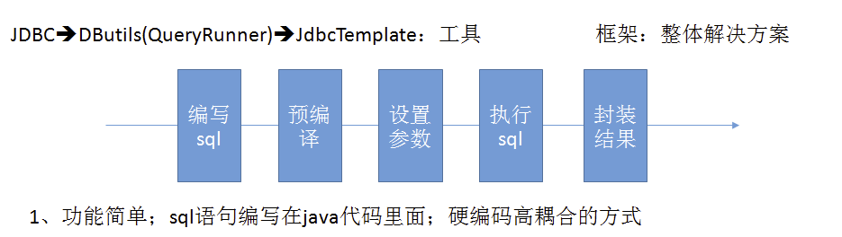
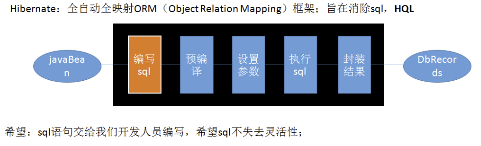
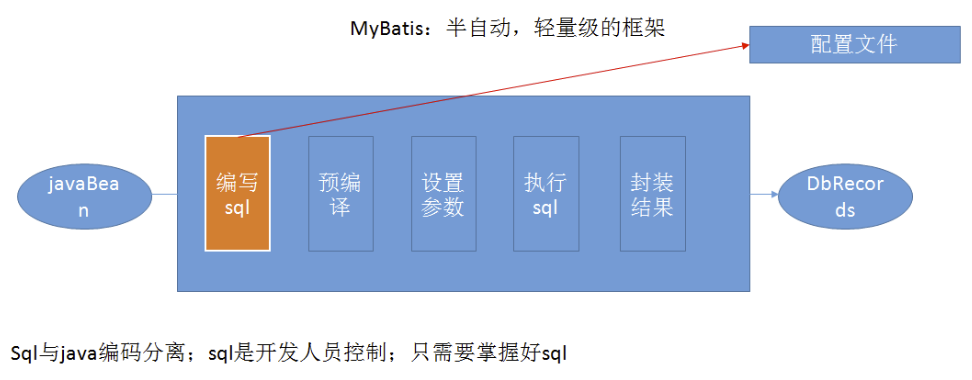
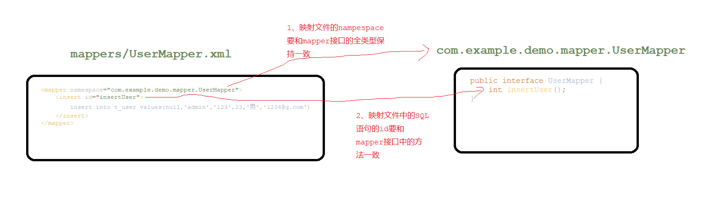

# MyBatis简介

## 1、和其它持久化层技术对比

**JDBC**

1. SQL夹在Java代码块里，耦合度高导致硬编码内伤

2. 维护不易且实际开发需求中sql是有变化，频繁修改的情况多见



**Hibernate和JPA**

1. 长难复杂SQL，对于Hibernate而言处理也不容易
2. 内部自动生产的SQL，不容易做特殊优化。
3. 基于全映射的全自动框架，大量字段的POJO进行部分映射时比较困难，导致数据库性能下降。



**MyBatis**

MyBatis是一个半自动化的持久化层框架。

1. 对开发人员而言，核心sql还是需要自己优化
2. sql和java编码分开，功能边界清晰，一个专注业务、一个专注数据。



# 搭建MyBatis

## 1、创建maven工程

引入依赖:mybatis,junit,mysql-connector-java

## 2、创建MyBatis的核心配置文件

习惯上命名为`mybatis-config.xml`，这个文件名仅仅只是建议，并非强制要求。将来整合Spring之后，这个配置文件可以省略，所以大家操作时可以直接复制、粘贴。
核心配置文件主要用于配置连接数据库的环境以及MyBatis的全局配置信息
核心配置文件存放的位置是src/main/resources目录下

```xml-dtd
<?xml version="1.0" encoding="UTF-8" ?> 
<!DOCTYPE configuration  
PUBLIC "-//mybatis.org//DTD Config 3.0//EN"  
"http://mybatis.org/dtd/mybatis-3-config.dtd">  
<configuration>  
	<!--设置连接数据库的环境-->  
	<environments default="development">  
		<environment id="development">  
			<!--设置连接方式:jdbc-->
			<transactionManager type="JDBC"/>  
			<dataSource type="POOLED">  
				<property name="driver" value="com.mysql.cj.jdbc.Driver"/>  
				<property name="url" value="jdbc:mysql://localhost:3306/MyBatis"/>  
				<property name="username" value="root"/>  
				<property name="password" value="123456"/>  
			</dataSource>  
		</environment>  
	</environments>  
	<!--引入映射文件-->  
	<mappers>  
		<mapper resource="mappers/UserMapper.xml"/>  
	</mappers>  
</configuration>
```

## 3、创建mapper接口

> MyBatis中的mapper接口相当于以前的dao。但是区别在于，mapper仅仅是接口，我们不需要提供实现类

```java

public interface UserMapper {

    /**
     * MyBatis面向接口变成的两个一致:
     * 1、映射文件的nampespace要和mapper接口的全类型保持一致
     * 2、映射文件中的SQL语句的id要和mapper接口中的方法一致
     */

    /**
     * 添加用户信息
     * 返回值是int表示查询结果的行数
     * @return
     */
    int insertUser();
}
```

## 4、创建MyBatis的映射文件（重点++）

**相关概念**：ORM（Object Relationship Mapping）对象关系映射。

- 对象：Java的实体类对象
- 关系：关系型数据库
- 映射：二者之间的对应关系

| Java概念 | 数据库概念 |
| -------- | ---------- |
| 类       | 表         |
| 属性     | 字段/列    |
| 对象     | 记录/行    |

**映射文件的命名规则**

- 表所对应的实体类的类名+Mapper.xml
- 例如：表t_user，映射的实体类为User，所对应的映射文件为UserMapper.xml
- 因此一个映射文件对应一个实体类，对应一张表的操作
- MyBatis映射文件用于编写SQL，访问以及操作表中的数据
- MyBatis映射文件存放的位置是src/main/resources/mappers目录下

**MyBatis中可以面向接口操作数据，要保证两个一致(重点++)**

- mapper接口的全类名和映射文件的命名空间（namespace）保持一致
- mapper接口中方法的方法名和映射文件中编写SQL的标签的id属性保持一致

```xml
<!DOCTYPE mapper
        PUBLIC "-//mybatis.org//DTD Mapper 3.0//EN"
        "http://mybatis.org/dtd/mybatis-3-mapper.dtd">
<mapper namespace="com.example.demo.mapper.UserMapper">
    <!--
        2、映射文件中的SQL语句的id要和mapper接口中的方法一致
        int insertUser();
    -->
    <insert id="insertUser">
        insert into t_user values(null,'admin','123',23,'男','1234@q.com')
    </insert>
</mapper>
```



# 默认的类型别名

# MyBatis的增删改查

# MyBatis获取参数值的两种方式（重点）

# MyBatis的各种查询功能

# 特殊SQL的执行(重点)

# 自定义映射resultMap(暂时不看)

# 动态SQL(重点)

# MyBatis的缓存（暂时不看）

# MyBatis的逆向工程（暂时不看）

# 分页插件（暂时不看）